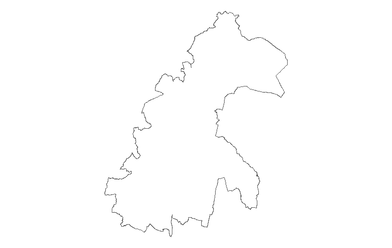
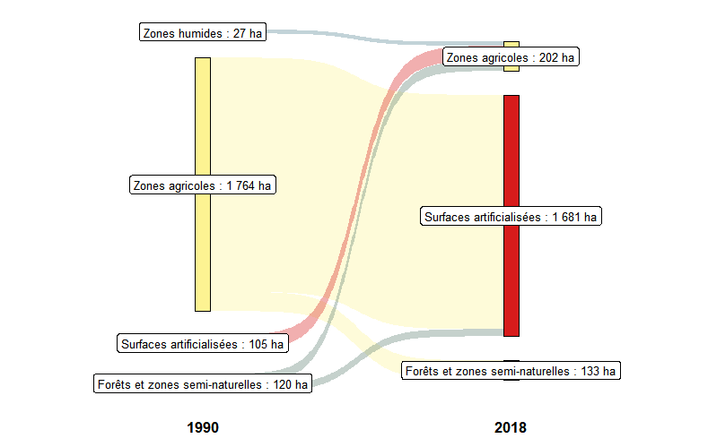
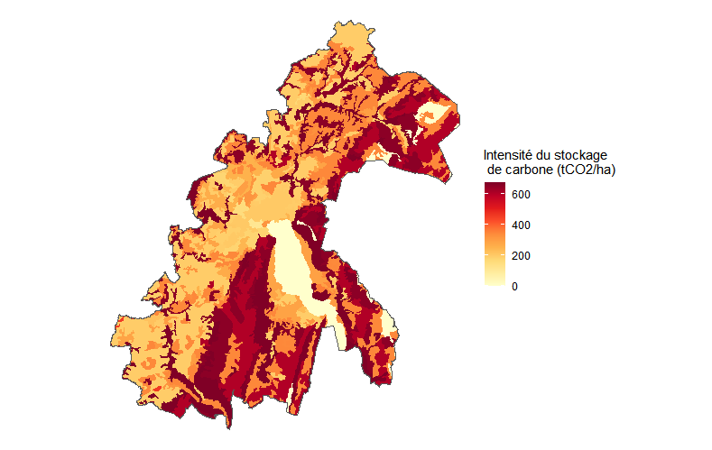
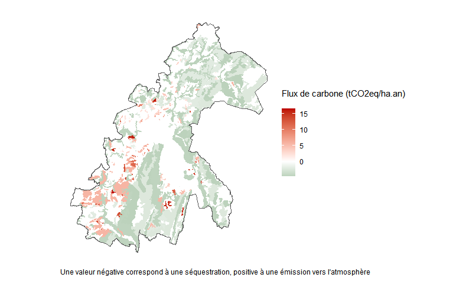
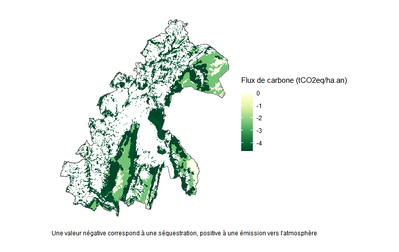

## Installation

La version en développement de Silvia peut être installée depuis GitHub, puis chargée dans l'environnement : 

``` r
# install.packages("devtools")
devtools::install_github("silvia-team/silvia")

library(silvia)
```


## Emplacement des données téléchargées

Le package utilise des données open source pour fonctionner (IGN, Corine Land Cover, gouvernement) qui sont téléchargées automatiquement depuis l'API ("Application Programming Interface") des bases de données en question.

Les fichiers téléchargés sont stockés à l'emplacement indiqué par l'utilisateur dans la fonction `setup_path()`: 

``` r 
data_path <- "D:/data_silvia"
data_path <- setup_path(data_path = data_path)
```
4 dossiers vides sont créés à l'emplacement indiqué :  


## Choix du territoire d'étude et téléchargement des données

Seules les données relatives au territoire sélectionné par l'utilisateur seront téléchargées, la première étape consiste donc à délimiter le territoire d'étude. 


L'outil laisse la possibilité de choisir des types de territoires différents, parmi les suivants : commune, EPCI, département, région. Chaque territoire est associé à son code INSEE, renseigné sur le [site de l'INSEE](https://www.insee.fr/fr/information/6051727). 


Voici un exemple de téléchargement des données relatives à l'EPCI du Grand Annecy, avec la fonction `download_territory_files()`: 

``` r 
download_territory_files(epcis_fr = "200066793", years = c(1990, 2000, 2012, 2018), data_path = data_path)
```

Les frontières du territoire sélectionné sont représentées à la fin du téléchargement des fichiers : 



*En l'état, il est conseillé de ne pas choisir de territoire plus étendu qu'un EPCI, pour des questions de temps de téléchargement des données.*


## Changement d'affectation des sols

La fonction `plot_land_use_changes()` permet de représenter les changements d'occupation des sols du territoire entre 2 années (parmi celles sélectionnées précédemment). Le résultat est présenté sous la forme d'un [diagramme de Sankey](https://fr.wikipedia.org/wiki/Diagramme_de_Sankey). 

``` r 
plot_land_use_changes(year_from = 1990, year_to = 2018, data_path = data_path)
```




## Stocks de carbone

Une estimation des stocks de carbone sur chaque parcelle du territoire est obtenue à partir de la fonction `get_carbon_stocks()`. On obtient une table géoréférencée avec les différents stocks calculés (dans les sols, dans la biomasse en forêt et hors forêt). 
Par exemple, les stocks de carbone du Grand Annecy en 2018 : 
``` r 
stocks <- get_carbon_stocks(year = 2018, data_path =data_path)
```

La fonction `plot_carbon_stocks()` réalise une cartographie des ces stocks de carbone sur le territoire à la date choisie : 

``` r 
plot_carbon_stocks(year = 2018, data_path = data_path)
```


Le bilan chiffré des stocks de carbone sur le territoire est réalisé par la fonction `get_carbon_stocks_balance()` :


| Stocks category                         | Stocks value |
| :----------                             | :---:        | 
| carbon stocks in biomass (ktCO2e)       | 2 140.10      | 
| carbon stocks in soils (ktCO2e)         | 9 117.22      |
| carbon stocks in harvested wood (ktCO2e)|   116.58     | 
| **total carbon stocks (ktCO2e)**           |   **11 373.90**   | 


## Flux de carbone 

De la même manière, l'estimation des flux de carbone (CO2eq) sur le territoire est obtenue avec la fonction `get_carbon_flows()`. 

A son tour, fonction `plot_carbon_stocks()` réalise une cartographie des flux de carbone sur le territoire à la date choisie.

Par exemple, les flux de carbone du Grand Annecy en 2018 : 
``` r 
plot_carbon_flows(year_from = 1990, year_to = 2018, data_path = data_path)
```


Le bilan chiffré des flux annnuels moyen de carbone sur le territoire est réalisé par la fonction `get_carbon_flows_balance()` :


| Flows category                         | Flows_value |
|:------------|:-------------------:| 
| carbon flows from land use changes (ktCO2e/an)       | -1.580      | 
| carbon flows from forest (ktCO2e/an)         | 37.020      |
| carbon flows from harvested wood (ktCO2e/an)|   -0.444     | 
| **total carbon flows (ktCO2e/an)**           |   **-39.040**   | 


## Flux de carbone forestiers

Il est possible de représenter plus précisément les flux de carbone des zones forestières avec la fonction `plot_forest_flows()`. 




# 

```{r, include = FALSE}
knitr::opts_chunk$set(
  collapse = TRUE,
  comment = "#>"
)
```


